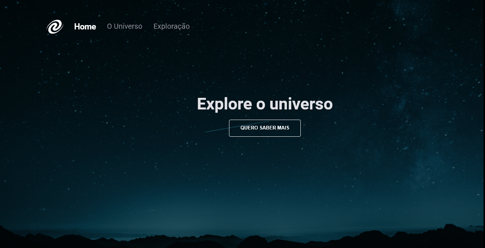

#  UniverseSPA

Projeto para resolução de desafio proposto no módulo "Stage-06" do curso Explorer da rocketseat.

## Sobre o desafio

O desafio consiste na criação de uma SPA para aplicar os conceitos aprendios em aula durante o módulo Stage 06.

## Preview 

## Aprendizados

- Conceitos de SPA;
- Mapeamento de rotas;
- Assíncrono e promises;
- Orientação a objetos;
- Classes e muito mais.

## Stack utilizada

**Front-end:** JavaScript, HTML e CSS

